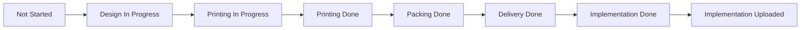

# CS to Implementation Flow Chart and User Manual

## Scope

This document explains the end-to-end production flow from CS monitoring to final implementation upload. It also includes the upstream Job Entry steps because the CS screen depends on job line items that are created there.

Main menu path:

`Production -> Job Entry -> CS -> Design -> Printing -> Lamination/Mounting & Packing -> Delivery -> Implementation`

Supporting screens:

`Implementation Download`, `Challan Dashboard`, `Invoice`, `All Invoices`, `MIS Report`, `Weekly Audit Report`, `Consolidated MIS Report`, and `Billing Export`.

## End-to-End Flow Chart

```mermaid
flowchart TD
    A[Login] --> B[Production > Job Entry]
    B --> C[Create or select job]
    C --> D[Add job line items]
    D --> E[Enter product, store, location, size, qty, media, deadline, and charges]
    E --> F{Estimate required?}

    F -- Yes --> G[Send Mail]
    G --> H[System creates estimate PDFs by billing location]
    H --> I[Customer approval or PO confirmation]

    F -- No --> I
    I --> J[Production > CS]
    J --> K[CS reviews line items, SLA, status, hold/pending jobs, and uploads]
    K --> L{Design required?}

    L -- Yes --> M[Production > Design]
    M --> N[Assign designer / update brief / set deadline]
    N --> O[Designer starts work]
    O --> P[Designer completes artwork / approval upload]

    L -- No --> Q[Production > Printing]
    P --> Q

    Q --> R[Select printing rows]
    R --> S[Select printer, media width, and media length]
    S --> T[Start printing job]
    T --> U[Stop printing job / printing complete]
    U --> V{Lamination, mounting, or packing needed?}

    V -- Yes --> W[Production > Lamination/Mounting & Packing]
    W --> X[Select rows and start job]
    X --> Y[Stop job / packing complete]

    V -- No --> Z[Production > Delivery]
    Y --> Z

    Z --> AA[Enter delivery person, mode, start time, and completion time]
    AA --> AB[Create delivery challan]
    AB --> AC[Production > Implementation]
    AC --> AD[Select implemented rows]
    AD --> AE[Set implementation timestamp and details]
    AE --> AF[Create implementation challan]
    AF --> AG[Upload implementation media]
    AG --> AH[Implementation Download / Challan Dashboard]
    AH --> AI[Invoice / Reports / Billing Export]
```

## Status Flow

If a job does not require design, packing, or delivery, skip that step and move the line item to the next required department.

## Roles

| Role | Main Work |
| --- | --- |
| CS / Customer Service | Monitor job line items, status, SLA, pending jobs, and customer coordination. |
| Job Entry User | Create job line items, estimate PDFs, and mail estimates to the customer. |
| Designer | Work on artwork, update design status, and upload approval/artwork details. |
| Printing Operator | Start and stop printing jobs with printer and media details. |
| Lamination/Mounting/Packing Operator | Complete finishing and packing activity. |
| Delivery Coordinator | Add delivery details and create delivery challan. |
| Implementation Executive | Complete implementation, create challan, and upload site media. |
| Billing/Admin | Generate invoices, download reports, and export billing data. |

## Quick Reference: Screens and Paths

| Screen | Menu Path | Purpose |
| --- | --- | --- |
| Job Entry | `Production > Job Entry` | Create job line items and estimate PDFs. |
| CS | `Production > CS` | Track all job rows, SLA, delivery, implementation, and upload status. |
| Design | `Production > Design` | Assign and complete artwork/design work. |
| Printing | `Production > Printing` | Start and stop printing work. |
| Lamination/Mounting & Packing | `Production > Lamination/Mounting & Packing` | Complete finishing and packing. |
| Delivery | `Production > Delivery` | Add delivery details and create delivery challan. |
| Implementation | `Production > Implementation` | Create implementation challan and upload proof media. |
| Implementation Download | `Production > Implementation Download` | Download/view implementation upload details. |
| Challan Dashboard | `Production > Challan Dashboard` | View challan records. |
| Invoice | `Production > Invoice` | Prepare invoice preview. |
| All Invoices | `Production > All Invoices` | View invoice list. |
| Reports | `Production > Reports` | MIS, weekly audit, consolidated MIS, and billing export. |

## User Manual

### 1. Login

1. Open the MIS application.
2. Enter username and password.
3. Click login.
4. Open the `Production` menu from the sidebar.

### 2. Master Data Check

Before creating or processing jobs, confirm that the required masters are available:

1. Open `Store Master` and confirm client/store/address details.
2. Open `Product Media Rates` and confirm media/rate details.
3. Open `Element Group Master` if element grouping is required for the job.

Correct master data prevents missing store names, wrong addresses, incorrect rates, and incomplete PDFs.

### 3. Job Entry

Use `Production > Job Entry` to create and maintain job line items.

1. Select or create the job.
2. Add each line item with the required job details:
   - Region or production location
   - Billing location
   - Salon/store name and address
   - Brand, product, element, and media
   - Visual code
   - Quantity
   - Width, height, billing width, and billing height
   - Printable square feet / billing square feet
   - Lamination, mounting, and implementation details
   - Deadline and remarks
3. Add line-item charges where applicable:
   - Installation charges
   - Transportation charges
   - Layouting charges
4. Save the job rows.
5. Use Excel copy/paste when multiple rows need to be added quickly.

### 4. Estimate PDF and Mail

Use the `Send Mail` option from Job Entry when the customer needs an estimate.

1. Select the required job rows.
2. Click `Send Mail`.
3. Confirm the `To`, `Subject`, and `Body`.
4. The system creates separate estimate PDF files by billing location.
5. Review the attachment list.
6. Click `Send Mail`.

Example: if selected line items have billing locations `North`, `South`, `East`, and `West`, the system creates separate estimate PDFs for each billing location.

The estimate PDF includes line items and the added charges:

- Installation charges
- Transportation charges
- Layouting charges

### 5. CS Monitoring

Use `Production > CS` as the main tracking screen.

1. Open the CS screen.
2. Use search, filters, and tabs to find the required job.
3. Check the line-item status.
4. Review SLA alerts and pending/hold jobs.
5. Confirm delivery, implementation, and implementation upload status.
6. Export data when required for coordination or reporting.

CS should verify these points before moving work forward:

- Job number is correct.
- Client name is correct.
- Store name and address are correct.
- Production location and billing location are correct.
- Quantity and dimensions are correct.
- Deadline is available.
- Charges are added where required.
- Customer approval or PO status is clear.

### 6. Design

Use `Production > Design` when artwork/design work is required.

1. Open the Design screen.
2. Search or filter the required job.
3. Select the job row.
4. Update designer name, design type, brief, query, and deadlines.
5. Start the design job.
6. Complete the design job after artwork is ready.
7. Upload approval/artwork images if required.
8. Refresh the list and confirm the status is updated.

If no design is required, the job can move directly to printing.

### 7. Printing

Use `Production > Printing` for print production.

1. Open the Printing screen.
2. Search/filter the required job rows.
3. Select the rows to print.
4. Select the printing machine/printer.
5. Enter media width and media length where required.
6. Click `Start Job`.
7. After printing is completed, click `Stop Job`.
8. Confirm the completed printing status.

If a row needs rework or reprint, use the available completed/reprint options as per the screen controls.

### 8. Lamination, Mounting, and Packing

Use `Production > Lamination/Mounting & Packing` when finishing or packing is required.

1. Open the Lamination/Mounting & Packing screen.
2. Search/filter by job, location, or store.
3. Select the required rows.
4. Click `Start Job`.
5. Complete lamination, mounting, and packing activity.
6. Click `Stop Job`.
7. View challan details if available.

If finishing/packing is not required, move the job to Delivery or Implementation as applicable.

### 9. Delivery

Use `Production > Delivery` when material needs to be dispatched.

1. Open the Delivery screen.
2. Select the required job rows.
3. Enter delivery person.
4. Enter delivery start time.
5. Enter delivery completed time.
6. Select delivery mode.
7. Click `Add` to save delivery details.
8. Click `Create Challan`.
9. Review challan details and save.

After delivery challan creation, the job can move to implementation.

### 10. Implementation

Use `Production > Implementation` for final site execution.

1. Open the Implementation screen.
2. Search/filter the required job rows.
3. Select the implemented rows.
4. Enter implementation timestamp/details.
5. Click `Create Implementation Challan`.
6. Upload implementation media.
7. Select media type/image type as required.
8. Enter implementation person, contact, and authority details if required.
9. Submit the upload.
10. Confirm the implementation upload status.

Implementation media is used as proof of execution and can be checked later from `Implementation Download` or related reports.

### 11. Invoice and Reports

After implementation is completed and proof is uploaded:

1. Use `Invoice` to prepare invoice preview.
2. Use `All Invoices` to view existing invoices.
3. Use `Challan Dashboard` to check delivery and implementation challans.
4. Use `MIS Report`, `Weekly Audit Report`, and `Consolidated MIS Report` for tracking.
5. Use `Billing Export` for billing data export.

## Common Controls

| Control | Use |
| --- | --- |
| Search | Find job number, client, store, city, or other visible row details. |
| Filters/Tabs | Narrow down jobs by status, location, or workflow area. |
| Checkbox | Select one or more rows for action. |
| Refresh | Reload latest data from the server. |
| Export/Download | Download Excel/CSV/PDF data where supported. |
| Start Job | Begin department work and capture start status/time. |
| Stop Job | Complete department work and capture end status/time. |
| Create Challan | Generate delivery or implementation challan for selected rows. |
| Upload Media | Upload implementation or approval proof. |

## Handoff Checklist

Before sending a job to the next department, verify:

- Job number and client are correct.
- Store/salon name and address are correct.
- Billing location and production location are correct.
- Product, media, element, and visual code are correct.
- Quantity, dimensions, and square feet are correct.
- Installation, transportation, and layouting charges are added when applicable.
- Deadline is entered.
- Customer approval/PO confirmation is available where required.
- Challan is created for delivery/implementation where required.
- Implementation proof media is uploaded after execution.

## Troubleshooting

| Issue | Check |
| --- | --- |
| Job rows are not visible in CS | Refresh the screen, check filters/tabs, and confirm rows were saved in Job Entry. |
| Estimate PDF is not split correctly | Confirm each line item has the correct billing location. |
| Charges are missing from PDF | Confirm installation, transportation, and layouting charges are entered in the line items before sending mail. |
| Cannot start printing | Select rows and enter required printer/media details. |
| Packing job is not visible | Confirm printing is completed and filters/location are correct. |
| Delivery challan is not created | Select rows and save delivery details before creating challan. |
| Implementation upload is missing | Confirm implementation challan is created and media upload was submitted successfully. |
| Status is not updated | Refresh the screen and verify the previous department has stopped/completed the job. |
| Login/auth callback is not working | Gmail OAuth callback flow is temporarily commented; use normal login as configured. |

## Recommended Daily Operating Flow

1. CS checks all new and pending jobs.
2. CS verifies job line-item data and estimate/approval status.
3. Design completes artwork where required.
4. Printing completes production.
5. Lamination/Mounting/Packing completes finishing.
6. Delivery creates challan and dispatches material.
7. Implementation executes the job and uploads proof.
8. Billing/Admin checks challan, invoice, and reports.

